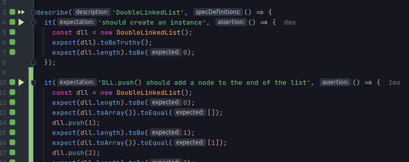

# Playground

A playground for things I'm learning/practicing.

Code is done in TypeScript using TDD.

## Code & Notes

* [Algorithms](src/tests/algos)
  * Useful concepts for solving problems
    * Pointers to go through an array/data structure
    * Sorting before we start
    * Hash maps to store partial results
    * Insert in reverse order on a new array size n, when creating a sorted array
* Data Structures
  * [JS Array](src/tests/data-structures/arrays.test.ts) [(big-o)](src/tests/data-structures/array.big-o.test.ts)
    * Sort
      * Without a sort function it will convert elements into strings, 80 comes before 9
      * The sorting algorithm is stable
        * Elements that are already sorted, will remain in the same position
      * Behaviour might not be well-defined unless
        * purity, stability, reflexivity, symmetry, and transitivity rules are respected
          * \> 0	sort a after b
          *  < 0	sort a before b
          *  === 0	keep original order of a and b
        * `const compare = (a, b) => a > b ? -1 : 0;`
          * Will have different results in V8 and SpiderMonkey
  * [JS Map](src/tests/data-structures/map.test.ts)
  * [JS Set](src/tests/data-structures/set.test.ts)
  * [Stack using Array](src/tests/data-structures/stack.test.ts)
  * [Singly Linked List](src/tests/data-structures/singly-linked-list.test.ts)
    * Benefits of a sorted list are lost on a sorted SLL
  * [Double Linked List](src/tests/data-structures/double-linked-list.test.ts)
    * Each node can be anywhere in memory, no need to resize an array
    * We don't need to shift position of elements when inserting or deleting like in an array
  * [Queue using Double Linked List](src/tests/data-structures/queue-with-dll.test.ts)
    * Using a DLL allows us to do operations O(1) for enqueue and dequeue
      * Faster than using a JS Array or an SLL
  * [Graph](src/tests/data-structures/graph.test.ts)
* [Interview Questions](src/tests/interview-questions)
* Design Patterns
* Math
* TypeScript
* [Archive](https://github.com/PabloRosales/playground/tree/a34ae4ab7b077816caeb972e93844c05bb6f2ef8/archive/pre-2022)
  * Includes old code for some AI/ML, JS, data structures, math, and SEO python notebooks
